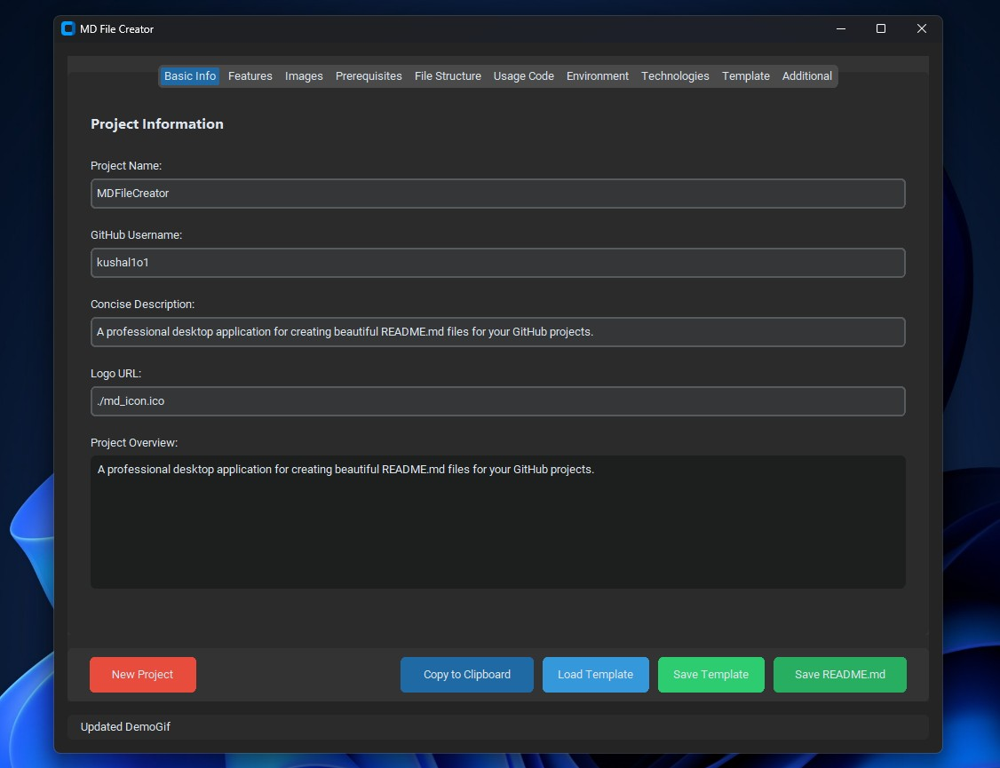
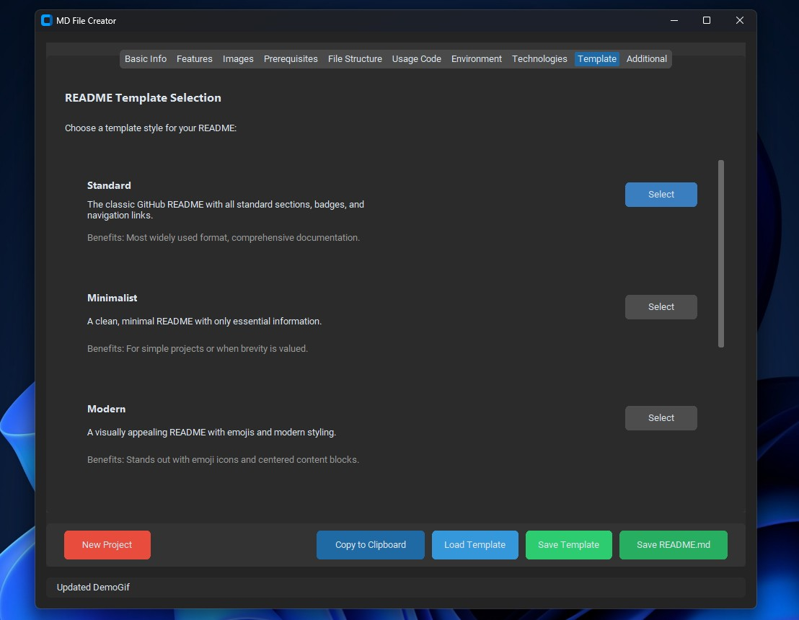
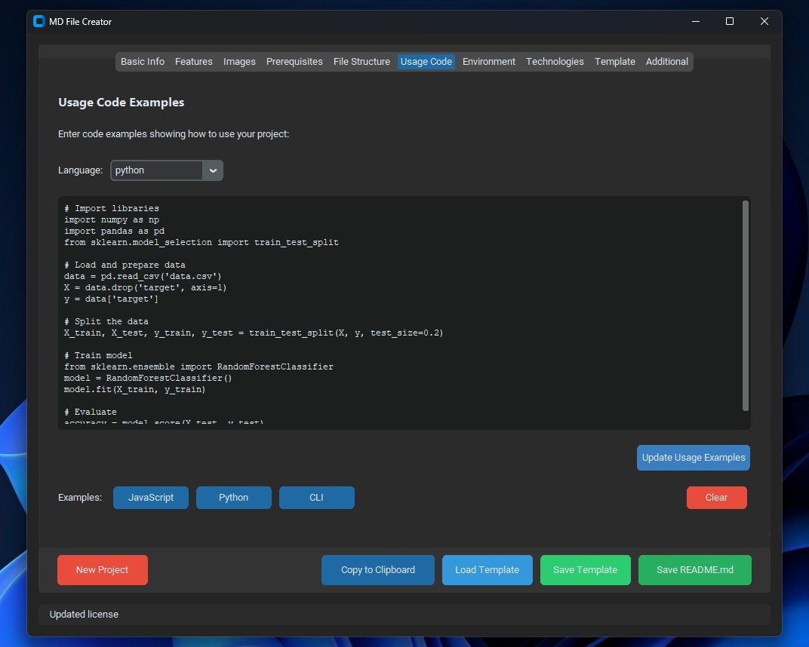

# MDFileCreator

<p align="center">
  
</p>

<p align="center">
  <a href="https://github.com/kushal1o1/MDFileCreator/stargazers"></a>
  <a href="https://github.com/kushal1o1/MDFileCreator/network/members"></a>
  <a href="https://github.com/kushal1o1/MDFileCreator/pulls"></a>
  <a href="https://github.com/kushal1o1/MDFileCreator/issues"></a>
  <a href="https://github.com/kushal1o1/MDFileCreator/graphs/contributors"></a>
</p>

<p align="center">
  <b>A professional desktop application for creating beautiful README.md files for your GitHub projects.</b>
</p>

<p align="center">
  <a href="#features">Features</a> •
  <a href="#demo">Demo</a> •
  <a href="#installation">Installation</a> •
  <a href="#usage">Usage</a> •
  <a href="#configuration">Configuration</a> •
  <a href="#api-reference">API Reference</a> •
  <a href="#documentation">Documentation</a> •
  <a href="#roadmap">Roadmap</a> •
  <a href="#contributing">Contributing</a> •
  <a href="#license">License</a> •
  <a href="#contact">Contact</a> •
  <a href="#acknowledgments">Acknowledgments</a>
</p>


## Overview

A professional desktop application for creating beautiful README.md files for your GitHub projects.

## Features

- **Modern UI - Clean, responsive interface with light and dark mode support**
- **Template Management - Save and load templates for consistent README styles**
- **Dynamic Content - Easily add/remove features, prerequisites, technologies and more**
- **mage Support - Include logos, screenshots, and demo GIFs with links**
- **Modern Styling - Generate beautiful, well-structured README files**
- **Enhanced Performance - Optimized for smooth operation even with large files**
- **Cross-Platform - Works on Windows, macOS, and Linux**


## Demo

<p align="center">
  
</p>

## Screenshot





## Installation
```bash
# Clone the repository
git clone https://github.com/kushal1o1/MDFileCreator.git

# Navigate to the project directory
cd MDFileCreator

pip install -r requirements.txt
```

### Prerequisites
- **python**
- **pillow**
- **customtkinter**
- **Refer requirements.txt**

## Usage

```javascript
python main.py
```

## Configuration

### Configuration File

Create a `config.json` file in the root directory with the following structure:

```json
nth
```

### Environment Variables

| Variable | Description | Default |
|----------|-------------|---------|
| `NO env vars` | No env variables used | `True` |

## Directory Structure

```
MdFileCreator/
├── .gitignore
├── app.py
├── create_icon.py
├── images/
│   ├── mdCreator.jpg
│   ├── mdCreator2.jpg
│   └── mdCreator3.jpg
├── main.py
├── md_generator.py
├── md_icon.ico
├── README.md
├── requirements.txt
├── ui_components.py
└── __pycache__/


```

## Technologies Used

<p align="center">

</p>

## Contributing

Contributions are what make the open source community such an amazing place to learn, inspire, and create. Any contributions you make are **greatly appreciated**.

1. Fork the Project
2. Create your Feature Branch (`git checkout -b feature/AmazingFeature`)
3. Commit your Changes (`git commit -m 'Add some AmazingFeature'`)
4. Push to the Branch (`git push origin feature/AmazingFeature`)
5. Open a Pull Request

Please make sure to update tests as appropriate and adhere to the [code of conduct](CODE_OF_CONDUCT.md).

## License

This project is licensed under the MIT License.

## Contact

share.kushal@gmail.com

---

<p align="center">
  Made with ❤️ by <a href="https://github.com/kushal1o1/MDFileCreator">MdCreator</a>
</p>